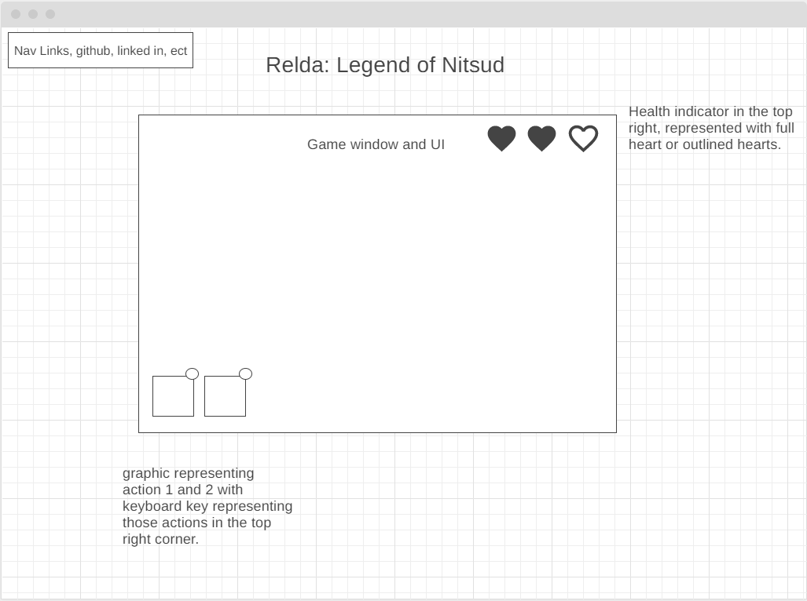

# Relda
### The legend of Nitsud


Checkout the [LIVE](https://dustin-adler.github.io/Relda_Legend_of_Nitsud/) version

## Synopsis: Goal

I want to recreate the boss fight from the original Zelda on NES. The game title will be Relda, the legend of Nitsud. Most of the background and other elements will be created using the canvas api. The game must track player's health bar, move and animate the mc sprite, as well as animate a the boss sprite and it's projectiles that will target the mc and reduce player health. Player will be able to control mc sprite movement and attacks within a designated grid that may have obsticles that can interact with the hit boxes of the projectiles. 

### Bonus
I'm starting with the Boss fight that is the most insteresting part of the castle, but I love that I can keep building this out. If time permits I can add additional rooms, including locked rooms that require keys, switch puzzles that only open doors if the elements are interacted with in the correct way, and additional enemies.

__*In "Relda: the legend of Nitsud", users will be able to:*__

1.   Traverse the room in pre-defined squares
2.   Keep track of health with a heart counter in the top right of the screen
3.   Attack enemies with a sword
4.   Dodge enemy attacks
5.   Become the Hero they always knew they could be
   
*__In addition, this project will include:__*

1.    Instructions for how to win
2.    Intuitive move and attack options relying on keyboard input
3.    Canvas background and other elements
4.    UI that includes valuable information like key: action map in a styalized fashion
5.    SFX that play alongside certain actions and events.

*Check out the wireframe for a high level view of how I plan on laying out the elements*


__*Technologies, Libraries, APIs*__

The Canvas API to render the game board
npm to manage project dependencies
HTML5
CSS3
Webpack

### Timeline

__Friday__: Canvas rendering to the screen correctly. Find most of if not all of the assets that I'm going to be using. Game class and background tile mapping system.

__Monday__: Create player class which will have logic for healthbars, movement, and all player animations.

__Tuesday__: I'm going to have the main boss animated as well as have audio and collision finnished.

__Wednesday__: Base of the game finished so that I can work on setting up the start game and ending game screens. Fluent game set up and restart.

__Thursday__: This day is devoted finishing touches minor bug fixes/quality of life improvements, publishing the work, and making sure that everything works correctly on the hosted site.

## Code Snipets 
### Main Character
   Main Character animations are different sizes and on different asset sheets depending on whether or not the player is attacking or which direction the player is facing when they are attacking. I had to custom cut each of the asset sheets pixel perfect, not just so the correct frame of the animation is showing at any given time, but also to make sure that there were no collision errors. The original NES was a huge influnce in my design decisions. All the tiles in my game are placed on 16px*16px grid and it was important to me that every action in the game is responsive and without bugs. Custom cutting the assets sheets to make sure that I always have pixel perfect animations and collision was instrumental in bringing that vision to life.
   
```
draw() {
     if (this.attacking && this.lastInput === "down"){
         this.ctx.drawImage( this.up_down_attack, this.dx * 23, this.dy * 23, 23, 23, this.x, this.y, 23, 23)

     } else if (this.attacking && this.lastInput === "up") {
         this.ctx.drawImage( this.up_down_attack, this.dx * 23, this.dy * 23, 23, 23, (this.x - 8) , (this.y - 8), 23, 23)

     } else if (this.attacking && this.lastInput === "left") {
         this.ctx.drawImage( this.left_right_attack, this.dx * this.w, this.dy * 21, this.w, 21, this.x, this.y, this.w, 21)

     } else if (this.attacking && this.lastInput === "right") {
         this.ctx.drawImage( this.left_right_attack, this.dx * this.w, this.dy * 21, this.w, 21, this.x, this.y, this.w, 21)

     }else {
         this.ctx.drawImage( this.mcSprite, this.dx * this.w, this.dy * this.h, this.w, this.h, this.x, this.y, this.w, this.h)

     }
} 
```

### Fireballs
One of the other more interesting challenges that I faced was figuring out how enemies were going to track the player as they moved around on the screen. No where is that more apparent then in the code that I wrote for the fireball targeting system. As it turns out triangulating the player position based on their current X and Y coordinates in relation to current enemy position X and Y coordinates is a simple and elegant way of handling this.

```
    getVelocity(){
        const angle = Math.atan2( this.targetY - this.y, this.targetX - this.x)
        this.velocityX = Math.cos(angle)
        this.velocityY = Math.sin(angle)
    }

    moveFireBall(){ 
        this.x += this.velocityX;
        this.y += this.velocityY;
    }
```

### Credits
Credit is given where credit is do. I couldn't have made my game without the contributions from these generous people.

Music Composed and produced by Marllon Silva a.k.a xDeviruchi 
https://xdeviruchi.itch.io/8-bit-fantasy-adventure-music-pack


Dragon Sprite and fireball ripped by Mister Mike
https://www.spriters-resource.com/nes/legendofzelda/sheet/8366/

mcSprite by Vryell
https://vryell.itch.io/tiny-adventure-pack


PIPOYA FREE RPG TILESET 16x16 Pixel
https://pipoya.itch.io/free-rpg-tileset-16x16
